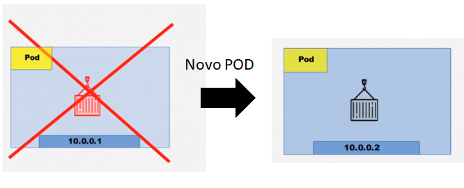

#Tutorial Kubernetes


# Introdução

Antes de falar de Kubernetes, segue alguns conceitos básicos do que fazer quando seu servidor/cluster não consegue escalar mais a aplicação.


O Kubernetes auxilia na orquestração de containers para manter a aplicação escalável


- Criar/Gerenciar Clusters

- Reiniciar contêineres de forma automática

  

  # Arquitetura do Kubernetes

Alguns componentes do Kubernetes


No exemplo é mostrado uma aplicação,  onde o serviço `svc` possuis `pods`(containeres) , gerenciados por um replica set `rs`  e um `deploy` ser escalados por um horizontal pod autoscaler `hpa`

Além de cada componente, podemos dividir componentes de controle e de nodes.


Segue uma visão geral do [site  oficial do kubernetes](https://kubernetes.io/docs/concepts/overview/components/)  .


A `API` (rest) tem o controle de tudo. Podemos acessar a `api` pelo `kubectl`.


# Aplicando os conceitos na prática

Para aplicar os conceitos na prática vamos 

## Usando Docker (windows)

Vamos cruar um cluster Kubernetes utilizando o docker-desktop, e ativar o Kubernetes nas configurações:


Agora temos acesso ao `kubectl` na linha de comando para usar Kubernetes.

## Usando minikube e Virtual Box no Linux


O Minikube é uma implementação leve do Kubernetes que cria uma VM em sua máquina local e implanta um cluster simples contendo apenas um nó. O Minikube está disponível para sistemas Linux, macOS e Windows. A linha de comando *(cli)* do Minikube fornece operações básicas de inicialização para trabalhar com seu cluster, incluindo iniciar, parar, status e excluir. 

Mais detalhes da instalação do Minikube [clicar aqui](https://minikube.sigs.k8s.io/docs/start/). 

# Pods


Analogia com Docker, dentro de um Pod podemos ter mais de um container.


- endereço IP do POD: Um POD possui um endereço IP, para o caso de mais containers dentro de um POD, é preciso atribuir portas **diferentes**. A vantagem é que os containers podem se comunicar como Localhost pois tem o mesmo IP.

  


- falha no POD, Kubernetes pode substituir o POD antigo (PODS são efêmeros)



## Aplicação prática

Criar pod

```bash
kubectl run nginx-pod --image=nginx:latest # criar pod
```


### Visualizando e localizando recursos

```bash
kubectl get pods                              # Listar todos os pods no namespace
```


Para mais informações veja o 

[Cheatsheet Kubernetes](https://kubernetes.io/pt-br/docs/reference/kubectl/cheatsheet/)


